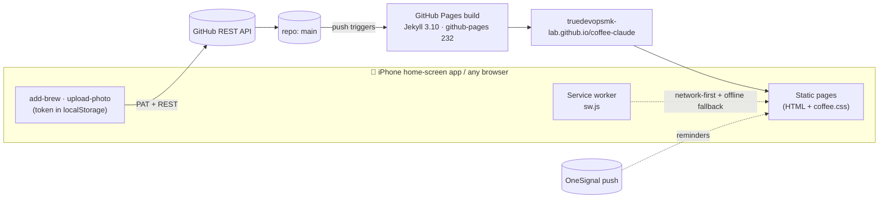
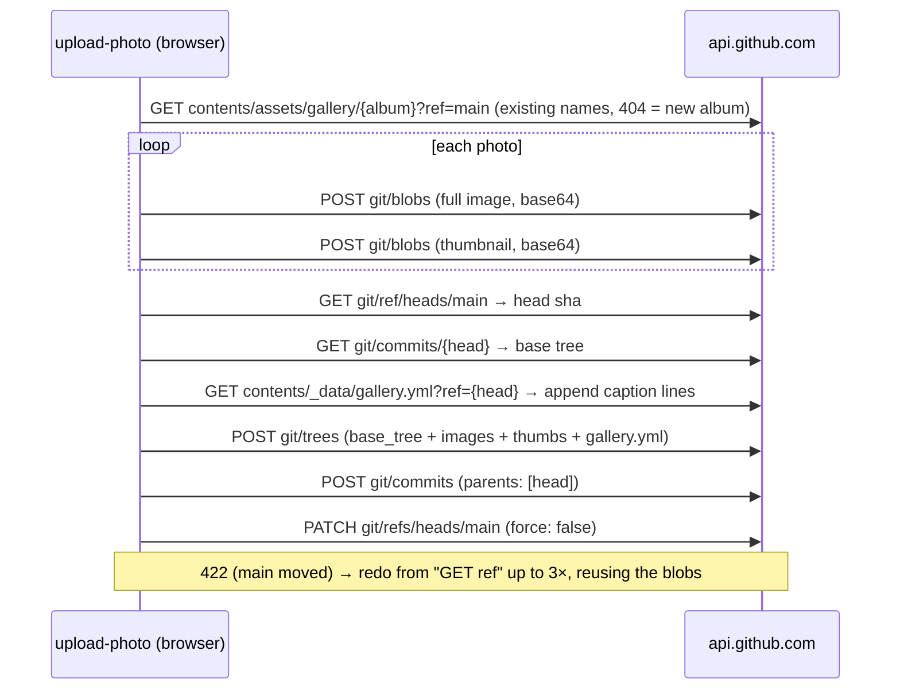

# ☕ Coffee Journal — "Brew Lab Notebook"

A personal coffee brewing & tasting journal: brew logs, bean profiles, brewing methods, a photo
gallery and a brew calculator. It's a static **Jekyll** site on **GitHub Pages** that installs on an
iPhone as a home-screen app (PWA). Brews and photos can be added **from the phone**: those pages
commit straight to this repo through the GitHub API.

- **Live site:** <https://truedevopsmk-lab.github.io/coffee-claude/>
- **Repo:** <https://github.com/truedevopsmk-lab/coffee-claude> (personal account `truedevopsmk-lab`)
- **Deploys:** every push to `main` → GitHub Pages rebuild (~1 min)

> **Working with an AI assistant?** Point it at [`AGENTS.md`](AGENTS.md) first (hard rules and
> pitfalls), then this README (full reference). A ready-made starter prompt is in
> [§17](#17-starting-a-new-llm--chat-session).

---

## Contents

1. [Features](#1-features)
2. [Tech stack & constraints](#2-tech-stack--constraints)
3. [Architecture](#3-architecture)
4. [Repository map](#4-repository-map)
5. [URLs & pages](#5-urls--pages)
6. [Content model](#6-content-model)
7. [Layouts, includes & page flags](#7-layouts-includes--page-flags)
8. [Design system](#8-design-system)
9. [Writing from the browser (GitHub API)](#9-writing-from-the-browser-github-api)
10. [The photo pipeline](#10-the-photo-pipeline)
11. [PWA, service worker & iPhone specifics](#11-pwa-service-worker--iphone-specifics)
12. [Push notifications (OneSignal)](#12-push-notifications-onesignal)
13. [Local development](#13-local-development)
14. [Deploying](#14-deploying)
15. [Testing & verification](#15-testing--verification)
16. [How-to recipes](#16-how-to-recipes)
17. [Starting a new LLM / chat session](#17-starting-a-new-llm--chat-session)
18. [Rebuilding from scratch](#18-rebuilding-from-scratch)
19. [Known issues & backlog](#19-known-issues--backlog)
20. [History](#20-history)
21. [Gotchas](#21-gotchas)

---

## 1. Features

| Area | What it does | Where |
|---|---|---|
| **Home** | Hero, live stats (brews / beans / methods / frames), latest 6 brews, 4 beans, client-side search, method cards | `index.md` |
| **Logbook** | All brews newest-first, filter chips by method, ratio/temp/rating on each card | `brews/index.md`, `_layouts/brew.html` |
| **Bean shelf** | All beans, filter chips by process, origin/process/variety chips | `beans/index.md`, `_layouts/bean.html` |
| **Methods** | One page of personal recipes per brewer | `methods/*.md` |
| **Brews & Frames** | Photo gallery grouped into albums, thumbnails, lightbox with swipe | `brews-and-frames/index.md`, `_data/gallery.yml` |
| **Brew calculator** | Scales a recipe from a dose (V60 4:6 with cumulative pour targets, Hoffmann, AeroPress, …), generates a markdown brew log | `tools/brew-calculator/` |
| **Log a brew** | Form (or paste markdown) → commits a brew file to the repo | `add-brew/index.html` |
| **Upload photos** | Batch photo upload: resize, strip GPS/EXIF, thumbnails, per-photo captions → **one commit** | `upload-photo/index.html` |
| **Settings** | Stores the GitHub token on this device | `journal-settings/index.html` |
| **Reminders** | Opt in/out of OneSignal push reminders | `notifications/index.html` |
| **PWA** | Installable, offline fallback, safe-area aware (notch, Dynamic Island, home indicator) | `manifest.json`, `sw.js`, `_includes/head.html` |
| **Dark mode** | Follows the OS, with a manual ◐ toggle (remembered) | `assets/coffee.css`, `_includes/footer.html` |

---

## 2. Tech stack & constraints

| Piece | Version / detail | Why it matters |
|---|---|---|
| Jekyll | **3.10.0** via the `github-pages` gem **232** | Must stay within what GitHub Pages builds natively; there is **no CI build step**. |
| Liquid | 4.0.4 | No Liquid 5 features. `divided_by` does integer division on two ints (see [Gotchas](#21-gotchas)). |
| Markdown | kramdown 2.4 | HTML blocks inside `.md` files are passed through unparsed. |
| Plugins | `jekyll-seo-tag` only | Only [Pages-whitelisted plugins](https://pages.github.com/versions/) are allowed. |
| Ruby (local only) | 3.2.2 via rbenv | macOS system Ruby 2.6 is too old. |
| JavaScript | Vanilla, no bundler, no npm | Scripts are inline `<script>` blocks or plain files in `assets/js/`. |
| CSS | One hand-written file, `assets/coffee.css` | Design tokens as CSS custom properties; per-page `<style>` blocks for page-only rules. |
| External CDNs | Google Fonts (Fraunces, Inter, JetBrains Mono), OneSignal v16 SDK, `heic2any@0.0.4` (loaded on demand) | Nothing else. |

**Design principles.** No build tooling. Content is plain markdown files. The phone is a first-class
authoring device. Everything degrades gracefully without JS except the write features.

---

## 3. Architecture



- **Read path:** Pages serves prebuilt HTML. Index pages, stats and the search index are computed
  **at build time** in Liquid. The only runtime JS is for filters, search, the lightbox, the
  calculator, the menu and the theme toggle.
- **Write path:** there is no server. The browser calls the GitHub API with a Personal Access
  Token saved on the device. The commit then triggers a Pages rebuild, and the change is live in
  about a minute.
- **Content discovery:** there are **no Jekyll collections or `_posts`**. Every section is just a
  folder of pages, found with
  `site.pages | where_exp: "p", "p.path contains 'brews/'" | where_exp: "p", "p.name != 'index.md'"`.

---

## 4. Repository map

```
coffee-claude/
├── _config.yml                 # title, baseurl (/coffee-claude), plugins, build excludes
├── Gemfile / Gemfile.lock      # github-pages gem (mirrors production) + webrick
├── _data/
│   └── gallery.yml             # gallery albums (order, titles) + per-image captions
├── _includes/
│   ├── head.html               # meta, viewport-fit=cover, PWA/Apple tags, versioned CSS, pre-paint theme
│   ├── nav.html                # sticky topbar + primary nav (collapses to a dropdown ≤860px)
│   ├── footer.html             # footer links, menu + theme-toggle JS, service-worker registration
│   └── gallery-card.html       # one gallery tile (thumbnail if present, full image for the lightbox)
├── _layouts/
│   ├── default.html            # generic page shell (+ OneSignal init); honours page flags (§7)
│   ├── brew.html               # structured brew page: title, spec/rating/cup-profile rail, notes
│   └── bean.html               # bean profile page (narrow)
├── index.md                    # home page (hero, stats, latest, search index, methods)
├── brews/                      # one .md per brew  + index.md (the logbook)
├── beans/                      # one .md per bean  + index.md (the shelf)
├── methods/                    # one .md per brewer + index.md
├── brews-and-frames/index.md   # gallery page
├── tools/brew-calculator/      # index.md (UI) + calculator.js (recipes & log builder)
├── add-brew/index.html         # "Log a brew" (form + paste markdown) → GitHub Contents API
├── upload-photo/index.html     # batch photo uploader → GitHub Git Data API (single commit)
├── journal-settings/index.html # save/clear the GitHub token (localStorage "gh_pat")
├── notifications/index.html    # OneSignal subscribe/unsubscribe
├── offline.html                # service-worker offline fallback (standalone page, no layout)
├── manifest.json               # PWA manifest (Liquid-processed; hard-coded /coffee-claude paths)
├── sw.js                       # service worker (Liquid-processed; cache name versioned per build)
├── assets/
│   ├── coffee.css              # the whole design system
│   ├── search.js               # home-page search
│   ├── js/gallery.js           # lightbox: keyboard, swipe, counter, preloading
│   ├── icons/icon-192.png, icon-512.png
│   ├── gallery/<Album>/        # full-size photos (the source of truth for "frames")
│   └── gallery-thumbs/<Album>/ # grid thumbnails, same filenames (short edge 540px, no EXIF)
├── scripts/make-thumbs.py      # backfills missing thumbnails (Pillow); excluded from the build
├── templates/                  # copy-paste templates for beans/brews (excluded from the build)
├── README.md                   # this file (excluded from the build)
├── AGENTS.md                   # rules for AI assistants (excluded from the build)
└── CLAUDE.md                   # imports AGENTS.md for Claude Code (excluded from the build)
```

---

## 5. URLs & pages

`baseurl` is **`/coffee-claude`** and `permalink: pretty`, so `brews/foo.md` becomes
`/coffee-claude/brews/foo/`. Always build links with `{{ '/path/' | relative_url }}`.

| URL | Source | Notes |
|---|---|---|
| `/` | `index.md` | Stats count pages per folder plus files in `assets/gallery/`. |
| `/brews/` | `brews/index.md` | Sorted by `date` descending; brews without `date` sink to the end. |
| `/brews/<file>/` | `brews/*.md` | Layout depends on front matter (`brew` or `default`). |
| `/beans/` · `/beans/<file>/` | `beans/` | Sorted by `title`. |
| `/methods/` · `/methods/<file>/` | `methods/` | Card title = the part of `title` before ` — `. |
| `/brews-and-frames/` | `brews-and-frames/index.md` | Gallery. |
| `/tools/brew-calculator/` | `tools/brew-calculator/index.md` | |
| `/add-brew/` | `add-brew/index.html` | Needs token. |
| `/upload-photo/` | `upload-photo/index.html` | Needs token. |
| `/journal-settings/` | `journal-settings/index.html` | |
| `/notifications/` | `notifications/index.html` | Linked from the footer ("Reminders"). |
| `/offline.html` | `offline.html` | Served by the service worker when offline. |

---

## 6. Content model

### 6.1 Brews — `brews/YYYY-MM-DD-<slug>.md`

Two shapes exist.

**Structured (preferred):** `layout: brew`. This is what `/add-brew/` writes. The front matter
drives the spec rail, the rating and the cup-profile bars.

```yaml
---
layout: brew
title: "V60 Brew Log — Udayagiri 72hrs Yeast Naturals"
date: 2026-06-19          # YYYY-MM-DD — required for sorting & cards
bean: "Udayagiri 72hrs Yeast Naturals"
roaster: "Aroma Fusion"
method: "V60"             # V60 | AeroPress | Chemex | French Press | Espresso | Cold Brew | Moka Pot | B75 | Other
dose: 15                  # grams (number)
water: 200                # grams (number) — ratio = water / dose, computed in Liquid
water_temp: 95            # °C (number)
brew_time: "2:55"
grind: "18 Clicks"
rating: 5                 # 0–5 stars (0 = unrated/hidden)
strength: 4               # 1–5 cup-profile bars
acidity: 2
body: 4
sweetness: 4
---
## ⚖️ Recipe
…free markdown: recipe list, cup profile table, tasting notes, "what I'd change next time"…
```

| Field | Used by |
|---|---|
| `title` | everywhere |
| `date` | sorting, card date, brew page eyebrow |
| `method` | method chip, logbook filter, spec rail |
| `bean`, `roaster` | card, chips, spec rail |
| `dose`, `water` | card ratio `1:x`, spec rail |
| `water_temp`, `brew_time`, `grind` | spec rail (+ temp on the card) |
| `rating` | stars on card & page |
| `strength`, `acidity`, `body`, `sweetness` | cup-profile bars (value × 20 %) |

**Free-form (legacy):** `layout: default`, with only `title` and everything else written in the
markdown body. These still render, but without the spec rail or card metadata. Eight of the
eleven brews are like this; see [§19](#19-known-issues--backlog).

### 6.2 Beans — `beans/<roaster>-<origin>-<name>.md`

```yaml
---
layout: bean
title: "Cafes Muda — Nestor Lasso Sidra, Colombia Huila"
origin: "Colombia, Huila"
variety: "Sidra"          # "Not specified" is hidden in chips
process: "Natural"        # drives the shelf's filter chips; "Not specified" is hidden
---
## … roaster, farm, producer, altitude, flavor notes, context, brew history …
```

`templates/beans.md` is the body template. Bean titles also feed the datalist on `/add-brew/` and
the bean picker in the calculator's log builder.

### 6.3 Methods — `methods/<brewer>.md`

```yaml
---
layout: default
title: "V60 — Personal Recipes"   # card shows "V60"
---
## Balanced Cup
- Ratio: 1:16 …
```

### 6.4 Gallery — `assets/gallery/<Album>/` + `_data/gallery.yml`

- **Frames:** every file under `assets/gallery/` is a frame. The gallery page and the home stat
  count them straight from `site.static_files`.
- **Albums:** the folder name is the album. Folders listed under `sections:` render in that order
  with a nice title and emoji. Unlisted folders are appended automatically at the bottom (title
  derived from the folder name, e.g. `morning-rituals` → "📸 Morning rituals"), and get a nav chip
  too.
- **Captions:** `captions:` maps `"/assets/gallery/<Album>/<file>"` to a caption string. Photos
  without a caption still show, just with no caption.
- **Thumbnails:** `assets/gallery-thumbs/<Album>/<same filename>`. When one exists, the grid uses
  it; otherwise it falls back to the full image. The lightbox always opens the full image.

```yaml
sections:                       # order = page order; folder must match the real (case-sensitive) path
  - key: crema-chronicles       # anchor id → /brews-and-frames/#gallery-crema-chronicles
    title: "☕ Crema Chronicles"
    folder: "/assets/gallery/Crema-Chronicles/"
captions:                       # MUST stay the last top-level key — the uploader appends to the end of the file
  "/assets/gallery/Crema-Chronicles/IMG_4256.jpeg": "Golden crema, perfect extraction"
```

Current albums: `Crema-Chronicles`, `brewers`, `beans`, `experiments`, `Infographs`, `travel`
(shown as "Brewed Elsewhere"), `events`.

### 6.5 Search index

`index.md` inlines `window.searchIndex = [...]`: title, URL, kind and the stripped text of every
page in `brews/`, `beans/`, `methods/` and `tools/`. `assets/search.js` matches pages where the
title or text contains **all** the typed terms (case-insensitive) and shows the top 20. It updates
on each keystroke and is built fresh with every deploy.

---

## 7. Layouts, includes & page flags

**`_layouts/default.html`** wraps content in `<main class="wrap">`. It also initialises the
OneSignal bell (the brew and bean layouts don't). It understands these front-matter flags:

| Flag | Effect |
|---|---|
| `title` | `<title>` and (unless hidden) the page header `<h1>` |
| `show_title: false` | Suppress the automatic page header. Custom pages render their own `.page-head` instead. |
| `eyebrow` | Small uppercase label above the auto header |
| `description` | Lede under the auto header + `<meta name="description">` |
| `narrow: true` | Max width 800px (`.wrap-narrow`) |
| `plain: true` | Don't wrap content in `.prose` (use for app-like pages with their own markup) |
| `no_sw: true` | Don't register the service worker on this page |

**`_layouts/brew.html`** is a grid with areas `head / aside / body`.

- **Mobile:** title → spec panels → notes.
- **≥880px:** a sticky 300px spec rail on the left, with title + notes on the right.
- **Panels:** Brew Spec (shown if any spec field exists), Rating, Cup Profile, Logbook.

**`_layouts/bean.html`** is a narrow page with origin/process/variety chips and a "← All beans"
button.

**Includes:** `head.html`, `nav.html`, `footer.html` (all chrome JS lives here) and
`gallery-card.html` (params: `file`, `thumbs`).

---

## 8. Design system

Everything lives in `assets/coffee.css`. The theme is "warm paper · espresso · brass", in light
and dark.

### Tokens (`:root`)

| Token | Light | Dark | Use |
|---|---|---|---|
| `--paper` / `--paper-2` | `#f6f0e8` / `#efe7dc` | `#170f0a` / `#1d140d` | page background |
| `--surface` / `--surface-2` | `#fffaf4` / `#f9f2e9` | `#221710` / `#2a1d13` | cards, panels, inputs |
| `--ink` / `--ink-soft` / `--ink-faint` | `#2c211b` / `#6b5c50` / `#93847a` | `#f1e7da` / `#c7b6a4` / `#9c8a78` | text |
| `--espresso` | `#43291f` | `#f3d9a8` | headings |
| `--brass` / `--brass-deep` | `#b5621e` / `#97501a` | `#e08c3f` / `#c6712a` | accent, CTAs, links |
| `--gold` | `#c08a2d` | `#e0b257` | stars, bar gradients |
| `--sage` / `--sage-deep` | `#6f8f72` / `#4f6d54` | `#9cc09f` / `#b7d6ba` | process chips, success |
| `--border` / `--border-soft` | `#e6dccf` / `#efe7db` | `#3b2a1c` / `#2f2114` | hairlines |
| `--radius` / `--radius-sm` / `--radius-pill` | 16px / 10px / 999px | | |
| `--serif` / `--sans` / `--mono` | Fraunces / Inter / JetBrains Mono | | headings / body / numbers |
| `--safe-top/right/bottom/left` | `env(safe-area-inset-*)` | | notch & home indicator |
| `--gutter` · `--topbar-h` · `--sticky-top` | 1.25rem · 62px · topbar + safe-top + 1rem | | layout |
| `--statusbar` | transparent; `#1a110b` in standalone mode | | band behind the iOS status bar |

**Dark mode** is `@media (prefers-color-scheme: dark)` unless `<html data-theme="light">` is set.
`data-theme="dark"` forces dark. The choice is stored in `localStorage.cj_theme` and applied before
first paint by an inline script in `head.html`, so there's no flash.

**Components:**

- Layout: `.wrap`, `.page-head` (with `.eyebrow`), `.section` / `.section-head`, `.card-grid` /
  `.card`, `.panel`
- Brews and beans: `.brew-card`, `.specs` (definition grid), `.taste` bars, `.rating`
- Controls: `.btn` (`-primary`, `-ghost`, `-sm`), `.filter-bar` / `.filter-btn`, `.tabs`
- Labels: `.chip` (`-method`, `-process`, `-origin`)
- Forms: `.field` / `.field-row` / `.field-row-3`, `.status-msg` (`.success`, `.error`, `.loading`)
- Gallery: `.gallery-grid` / `.gallery-card` / `.gallery-lightbox`
- Utilities: `.hidden` and `[hidden]` (both `display: none !important`), `.visually-hidden`

**Breakpoints**

| Width | Change |
|---|---|
| ≤ 860px | nav collapses to ☰ dropdown; form rows stack; upload bar floats |
| < 880px | brew page single column (560–879px: spec panels in 2 columns) |
| ≤ 640px | chip rows scroll sideways; lightbox goes full-screen; drop zone hidden on touch |
| ≤ 480px | gallery 2 columns; tighter hero & page padding |

**Rules to keep:**

- Hover effects go inside `@media (hover: hover)`, because iOS keeps `:hover` stuck after a tap.
  Touch-only behaviour (e.g. always-visible gallery captions) goes in `@media (hover: none)`.
- Any `position: fixed/sticky` UI, and edge padding, must include the `--safe-*` insets.
- Form inputs stay ≥ 16px, or iOS zooms the page on focus.
- `prefers-reduced-motion` disables all transitions and animations.

---

## 9. Writing from the browser (GitHub API)

**Auth.** Create a GitHub PAT: a classic token with `repo` scope, or fine-grained with
**Contents: read & write** on this repo only. Paste it on `/journal-settings/`. It's stored in
**`localStorage.gh_pat`** on that device only and sent only to `api.github.com`. Each device or
browser needs its own save, and the iPhone home-screen app has its **own storage separate from
Safari**. If you get a 401, the token expired; paste a new one.

### 9.1 Log a brew — `/add-brew/`

- **Guided form:** fields → a `layout: brew` file (schema in §6.1) plus markdown sections (Recipe,
  Cup Profile table, Tasting Notes, What I'd Change).
  - File name: `brews/{date}-{bean-slug}-{method-slug}.md`
  - Commit message: `brew: add {method} log — {bean} ({date})`
- **Paste markdown:** a full file with front matter. It needs `title` and `date: YYYY-MM-DD`, and is
  saved as `brews/{date}-{title-slug}.md`.
- Both use the **Contents API**: `PUT /repos/{owner}/{repo}/contents/{path}`, one commit.

### 9.2 Upload photos — `/upload-photo/`

Uses the **Git Data API**, so a whole batch becomes **one commit** and one Pages rebuild:



- Every call uses `cache: 'no-store'`. A cached ref would make the fast-forward update fail.
- Uploaded files land at `assets/gallery/{album}/{date}-{safe-name}.jpg` and the matching path
  under `assets/gallery-thumbs/`.
- Names that clash with the album or the batch get `-2`, `-3`, … suffixes, so nothing is ever
  overwritten.
- Commit message: `gallery: add N photos to {album} [tags]`, with the file list in the body.
- **Failure handling:** a failed commit leaves `main` untouched. Retrying reuses the blob SHAs, so
  the photos aren't uploaded again. Auth or permission errors (401/403) and network errors stop
  the batch; other per-photo errors are shown on that photo's card.

---

## 10. The photo pipeline

This all happens in the browser before anything is uploaded.

1. **Decode.** Native `` decode first; Safari 17+ decodes HEIC itself. If that fails for a
   HEIC, `heic2any` is loaded from the CDN on demand and converts to JPEG.
2. **Resize.** The long edge is capped by a preset:

   | Preset | Long edge | JPEG quality |
   |---|---|---|
   | High | 2560px | 0.90 |
   | Medium (default) | 2048px | 0.82 |
   | Low | 1440px | 0.72 |

3. **Re-encode to JPEG** on a canvas. The browser has already applied the EXIF rotation, so the
   output is upright. Re-encoding **drops all EXIF, including GPS**. Transparent PNGs are
   flattened onto white.
4. **Thumbnail.** Drawn from the resized canvas: short edge 540px, quality 0.78.
5. **Limits.** At most **2 photos are decoded at a time** (iOS Safari caps canvas memory), and
   canvases are zero-sized right after use. Anything still over 10 MB after compression is
   rejected.
6. **Changing the preset** re-encodes every photo not yet uploaded.

**Page UX:**

- Pick from the camera or library, drag & drop, or paste.
- Each photo gets its own caption field; blank ones use the "Default caption".
- The album and "new album" choice is remembered in `localStorage.cj_last_album`.
- On phones the upload button floats above the home indicator.
- There's a progress bar, and a screen wake lock keeps iOS from suspending the page mid-upload.
- A leave-page warning appears while uploading.

**Photos added by git instead of the uploader** have no thumbnails (the grid falls back to the full
image) and keep their EXIF. Backfill thumbnails with:

```bash
python3 scripts/make-thumbs.py          # writes missing thumbs, removes orphans
python3 scripts/make-thumbs.py --force  # rebuild all
```

It needs Pillow (`pip3 install Pillow`). It bakes in rotation, strips EXIF and keeps the colour
profile.

---

## 11. PWA, service worker & iPhone specifics

- **`manifest.json`:** name "Coffee Journal", `start_url`/`scope` `/coffee-claude/`,
  `display: standalone`, theme `#b5621e`, background `#1a0f00`, icons 192/512.
- **`head.html`:**
  - `viewport-fit=cover` lets the page draw edge-to-edge.
  - `apple-mobile-web-app-capable` and `apple-mobile-web-app-status-bar-style: black-translucent`
    mean that in the home-screen app **content sits under the status bar and iOS draws white
    status-bar text**.
  - The stylesheet link carries `?v={{ site.time }}` to bust caches on each deploy.
- **Safe areas:** the sticky topbar has `border-top: var(--safe-top) solid var(--statusbar)`.
  - In a browser tab the band is transparent (0 height when there's no inset).
  - In standalone mode it's dark `#1a110b`, so the white status-bar text stays readable on the
    cream theme.
  - The same insets pad the mobile menu, footer, lightbox, upload bar and landscape side gutters.
- **`sw.js`:**
  - The cache name is `coffee-journal-<build timestamp>`, so **every deploy invalidates the old
    cache** automatically.
  - It precaches the core pages and `coffee.css`.
  - **Network-first** for page navigations and same-origin `.css`/`.js`, falling back to the cache
    and then to `offline.html`.
  - Images, the GitHub API, CDNs and all non-GET requests aren't intercepted.
  - `skipWaiting` + `clients.claim`: a new version takes over on the next navigation. On iPhone,
    force-quit and reopen the app once to be sure.
- **Hard-coded paths:** `manifest.json`, `sw.js` and `offline.html` hard-code `/coffee-claude/`.
  Update them if `baseurl` ever changes (see §16).

---

## 12. Push notifications (OneSignal)

- `_layouts/default.html` loads the OneSignal v16 SDK with app id
  `1d199315-1efa-496e-8cff-06894493dbd2` and shows the bell bottom-right. It has a safe-area
  margin and is lifted above the upload bar.
- `/notifications/` has an explicit Subscribe/Unsubscribe button.
- The app is locked to `https://truedevopsmk-lab.github.io`. On localhost the console shows
  `Can only be used on: https://truedevopsmk-lab.github.io`, which is expected and harmless.
- iOS only allows web push in the **home-screen app** (iOS 16.4+), not in a Safari tab.
- Reminders are sent from the OneSignal dashboard; nothing in this repo schedules them.

---

## 13. Local development

```bash
# one-time (macOS)
brew install rbenv ruby-build
rbenv install 3.2.2
cd coffee-claude && rbenv local 3.2.2        # optional: writes .ruby-version (or use your global rbenv version)
bundle install

# every shell
export PATH="/opt/homebrew/bin:$PATH" && eval "$(rbenv init - bash)"

bundle exec jekyll serve                      # → http://localhost:4000/coffee-claude/
bundle exec jekyll build --destination /tmp/coffee-site   # build check without writing _site/ into the repo
```

- The repo usually lives in **OneDrive**. Files can be cloud-only placeholders, so the first read of
  `assets/gallery/*` may stall while they download. Building to `/tmp` keeps `_site/` out of
  OneDrive sync.
- A second clone may exist at `~/Tech/Coffee/coffee-claude`. Pull before editing whichever one you
  use.
- The write pages work locally too, but they **commit to the real repo**. Test them with a mocked
  `fetch` (§15) instead.

---

## 14. Deploying

- `main` **is** production. GitHub Pages builds from the repo root on every push; check
  **Actions → "pages build and deployment"**.
- This is a **personal** repo. On this Mac, switch identity first:

  ```bash
  gitswitch personal          # shell function: loads ~/.ssh/id_ed25519_personal, sets repo user.name/email
  git push origin main
  # or, without gitswitch:
  GIT_SSH_COMMAND="ssh -i ~/.ssh/id_ed25519_personal -o IdentitiesOnly=yes" git push origin main
  ```

- Commits made from the phone land directly on `main`, so **`git pull` before local work**.
- Rollback: `git revert <sha> && git push`. The branch `Backup-June-19-2026` is a snapshot from
  before the redesign.

---

## 15. Testing & verification

There's no automated test suite. Before pushing:

1. **Build cleanly:** `bundle exec jekyll build --destination /tmp/coffee-site`, with no Liquid
   errors.
2. **Spot-check the output:**

   ```bash
   grep -c 'gallery-thumbs' /tmp/coffee-site/brews-and-frames/index.html   # tiles using thumbnails
   grep -o 'coffee.css?v=[0-9]*' /tmp/coffee-site/index.html                # cache-busted stylesheet
   grep CACHE_NAME /tmp/coffee-site/sw.js                                   # per-build cache name
   ```

3. **Look at it on a phone-sized screen.** Serve the build under the baseurl:

   ```bash
   mkdir -p /tmp/serve && ln -sfn /tmp/coffee-site /tmp/serve/coffee-claude
   python3 -m http.server 4123 -d /tmp/serve
   ```

   Then open `http://localhost:4123/coffee-claude/` in Chrome DevTools device mode (iPhone, touch).
   For notch testing, headless Chrome can fake insets through the DevTools Protocol
   `Emulation.setSafeAreaInsetsOverride({insets:{top:59,bottom:34}})`. It **cannot** emulate
   `display-mode: standalone`; set `--statusbar: #1a110b` by hand to preview that band.
4. **Test the writers without writing.** Override `window.fetch` for `https://api.github.com/*` in
   the page (e.g. via `Page.addScriptToEvaluateOnNewDocument`). Return fake SHAs, record the
   requests, and assert on the tree paths, the `gallery.yml` diff and the commit message.
   **Never** point tests at the real repo.
5. **After deploy:** load the live site, and on iPhone force-quit and reopen the home-screen app.

---

## 16. How-to recipes

| Task | Steps |
|---|---|
| **Add a brew by hand** | Create `brews/YYYY-MM-DD-bean-method.md` with the §6.1 front matter (`layout: brew`, always include `date`). File names: lowercase, hyphens, **no spaces**. |
| **Add a bean** | Create `beans/<roaster>-<origin>-<name>.md` with the §6.2 front matter; body from `templates/beans.md`. |
| **Add a method** | Create `methods/<brewer>.md` with `title: "<Brewer> — Personal Recipes"`. |
| **Add a calculator recipe** | In `tools/brew-calculator/calculator.js`, push `{ id, name, render: (coffee) => html }` into a method's `recipes`, or add a new method object. `render` returns HTML with a `<ul>` of params; an optional `<table class="pour-schedule">` is copied into generated logs. Grinder, scale and server options are hard-coded in `tools/brew-calculator/index.md`. |
| **New gallery album** | Upload with "➕ New album…" (it auto-appears at the bottom). For a custom title or position, add a `sections:` entry whose `folder` matches the real path exactly (case-sensitive). |
| **Add photos via git** | Put URL-safe files (no spaces) in `assets/gallery/<Album>/`, add `captions:` lines, run `python3 scripts/make-thumbs.py`, commit everything. |
| **Rename or remove a photo** | Change or delete the file in `assets/gallery/…`, its caption key, then run `make-thumbs.py` (it removes orphaned thumbnails). |
| **Change colours or fonts** | Edit the tokens at the top of `assets/coffee.css`: the light `:root` **and both dark blocks** (the media query and `[data-theme="dark"]`). Fonts: the `@import` at the top. |
| **Add a nav item** | `_includes/nav.html` (and optionally the footer links in `_includes/footer.html`). Use `relative_url`; add an `active` class test on `page.url`. |
| **Add a new page** | `newpage/index.html` or `.md` with `layout: default`, `title`, and usually `show_title: false` + `plain: true` plus your own `.page-head`. Add it to `PRECACHE_URLS` in `sw.js` if it should work offline. |
| **Fork, or rename the repo or baseurl** | Update `baseurl`/`url` in `_config.yml`; the `/coffee-claude/` paths in `manifest.json`, `sw.js`, `offline.html`; `REPO_OWNER`/`REPO_NAME` in `upload-photo/index.html`; the API URL in `add-brew/index.html` (×2); the links in `_includes/footer.html` and `journal-settings/index.html`; the OneSignal app & domain. |
| **Change upload size presets** | `PRESETS`, `THUMB_SHORT_EDGE`, `MAX_PARALLEL` at the top of the `upload-photo` script. Keep `SHORT_EDGE` in `scripts/make-thumbs.py` in sync. |

---

## 17. Starting a new LLM / chat session

Paste this at the start of a session (Claude, ChatGPT, Gemini, Copilot…), then describe the change:

```text
You're helping me change my personal Jekyll site "coffee-claude" (a coffee brewing journal PWA on
GitHub Pages: https://github.com/truedevopsmk-lab/coffee-claude).
Before proposing code, read AGENTS.md (hard rules) and README.md (architecture, content model,
design system). Constraints: GitHub Pages' github-pages gem (Jekyll 3.10, Liquid 4, whitelisted
plugins only), no build tools or npm, vanilla JS, one CSS file with design tokens, baseurl
/coffee-claude (always use relative_url). It is used mainly as an iPhone home-screen app, so respect
safe-area insets and touch (no hover-only UI). Match the existing code style. Tell me how to verify
the change (jekyll build + what to look at) and never run the GitHub write flows against the real
repo in tests.

The change I want: …
```

If the tool can't read the repo, paste `AGENTS.md`, this README and the files you want changed.

---

## 18. Rebuilding from scratch

A build order where each step is shippable. Use it as a spec when recreating the site, or porting it
to another stack.

1. **Repo & hosting.** Public repo, GitHub Pages from `main` / root. `Gemfile` with
   `github-pages`; `_config.yml` with `title`, `description`, `baseurl: /coffee-claude`,
   `url: https://<user>.github.io`, `permalink: pretty`, `plugins: [jekyll-seo-tag]`, and
   `exclude` for tooling and docs.
   - ✅ An `index.md` "hello" is live at `/coffee-claude/`.
2. **Chrome & design system.** `_includes/head.html` (viewport-fit=cover, fonts, CSS, pre-paint
   theme script, ``), `nav.html` (sticky topbar, ☰ dropdown ≤860px), `footer.html`
   (links, menu + theme JS). `assets/coffee.css` with the §8 tokens, light/dark and safe-area vars.
   `_layouts/default.html` with the §7 flags.
   - ✅ Light/dark toggle persists; the notch doesn't cover the header.
3. **Content & indexes.** Folders `brews/`, `beans/`, `methods/` of pages, each with an `index.md`
   listing them via `site.pages | where_exp` (§3). Cards: brew (date, method chip, title, bean,
   ratio, temp, stars) and bean (origin/process/variety chips). Filter chips via `data-*`
   attributes and a small click handler.
   - ✅ Adding a `.md` file makes it appear with no config.
4. **Detail layouts.** `brew.html` (grid areas; sticky spec rail ≥880px; spec/rating/cup-profile
   from front matter) and `bean.html`.
   - ✅ The ratio shows with one decimal (`dose | plus: 0.0`).
5. **Home.** Hero, stats, latest 6 brews, 4 beans, method cards, inline search index +
   `search.js`.
6. **Gallery.** `_data/gallery.yml` (sections + captions); the page groups `site.static_files`
   under `/assets/gallery/` by folder, with configured sections first, then auto-detected folders
   plus nav chips. `gallery-card.html` uses thumbnails with a full-image fallback; `gallery.js`
   lightbox (keyboard, swipe, counter, preload, focus trap).
   - ✅ Dropping a file into a new folder creates an album.
7. **Calculator.** A method/recipe registry in `calculator.js`; `render(dose)` returns HTML; the
   log builder turns the output into markdown (copy/download).
8. **PWA.** `manifest.json`, icons, Apple meta, `sw.js` (per-build cache name, network-first for
   pages/CSS/JS, offline page), registration in the footer.
   - ✅ Installs on iPhone; CSS changes show up after one relaunch.
9. **Token & writers.** `/journal-settings/` (token in `localStorage.gh_pat`); `/add-brew/`
   (form + paste → Contents API PUT); `/upload-photo/` (§9.2 + §10 pipeline).
   - ✅ A 10-photo batch gives one commit, no EXIF, thumbnails, captions in `gallery.yml`.
10. **Notifications.** OneSignal SDK in the default layout and a `/notifications/` toggle page.

---

## 19. Known issues & backlog

| # | Issue | Notes / fix idea |
|---|---|---|
| 1 | **Existing photos contain GPS coordinates.** 36 of the 50 images in `assets/gallery/` carry GPS in their EXIF, and the repo is public. | New uploads are clean. Strip the old ones losslessly (e.g. `exiftool -gps:all= -overwrite_original`), or re-encode. The data also stays in git history unless history is rewritten. |
| 2 | **Brew "Older / Newer" links never render.** `brew.html` uses `page.previous/next`, which only exist for posts and collections, not plain pages. | Compute neighbours in Liquid from the date-sorted brew list, or move brews into a collection. |
| 3 | **8 of 11 brews are free-form** (`layout: default`), so they get no spec rail, method chip or card metadata. | Convert them to `layout: brew` with the §6.1 fields. |
| 4 | **6 brews have no `date`** (the January/February logs), so they show no date and sort to the end. | Add `date:` to their front matter. |
| 5 | `brews/2026-02-22-sidama-moka pot.md` has a **space in its filename**, which gives a `%20` URL. | Rename (and consider a redirect). |
| 6 | `/add-brew/` defaults the date with `toISOString()` (UTC), so between midnight and 05:30 IST it pre-fills **yesterday**. | Use the local-date helper from the upload page. |
| 7 | `/add-brew/` never overwrites, but a second brew with the same date + bean + method fails with a GitHub 422 (the file already exists). | Add a `-2` suffix like the uploader does. |
| 8 | The search index skips `tools/brew-calculator/index.md` (its `name` is `index.md`), so the "Tool" kind never appears. | Special-case it. |
| 9 | The home page's method cards all show ⚙️; `method_icons` is defined but unused. | Map the icons by title. |
| 10 | Uploaded photos use one date field for the whole batch. | Read each photo's capture date (EXIF `DateTimeOriginal`) before stripping. |
| 11 | Ideas | A bottom tab bar in standalone mode; per-album cover images; a "brewed with this bean" list on bean pages. |

---

## 20. History

| Date | Milestone |
|---|---|
| 2026-02-22 | Initial Jekyll journal |
| 2026-02-23 | PWA manifest, service worker & offline, OneSignal reminders, on-the-go brew logging via GitHub API, paste-markdown tab |
| 2026-03-14 | Photo upload with HEIC→JPEG and quality selector; fixes for BOM / base64 in `gallery.yml` |
| 2026-06-19 | "Brew lab notebook" redesign of the whole site (pre-redesign snapshot: branch `Backup-June-19-2026`) |
| 2026-06-21 | Calculator: cumulative scale targets for Tetsu Kasuya 4:6; Infographs album |
| 2026-09-27 | iPhone safe-area fix (header under the Dynamic Island); service-worker cache versioning; single-commit batch uploads with per-photo captions, resizing and EXIF/GPS stripping; gallery thumbnails; full-screen mobile lightbox; brew layout mobile order; Cup Profile bars fix |
| 2026-09-28 | This documentation, `AGENTS.md`, `CLAUDE.md` |

---

## 21. Gotchas

- **Liquid integer division:** `200 | divided_by: 15` gives `13`. Make one side a float first:

  ```liquid
  
     → 13.3
  ```

- **`gallery.yml`:** must be UTF-8 **without a BOM** (the uploader checks), keep `captions:` last,
  and caption keys must match file paths exactly, including case.
- **File names:** URL-safe only (lowercase, hyphens, no spaces) for photos and pages.
- **Tokens:** a token saved in Safari isn't visible to the home-screen app, and vice versa.
- **Cached CSS:** if a CSS change doesn't show on the phone, the build probably didn't finish or
  the app wasn't relaunched. The service worker and the `?v=` parameter handle everything else.
- **Rebuild bursts:** every commit triggers a Pages rebuild. Batch changes into one commit where
  possible, as the uploader does.
